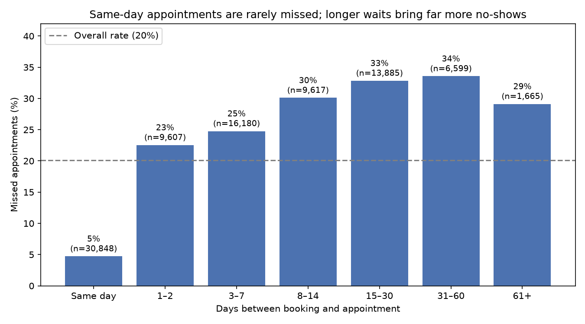
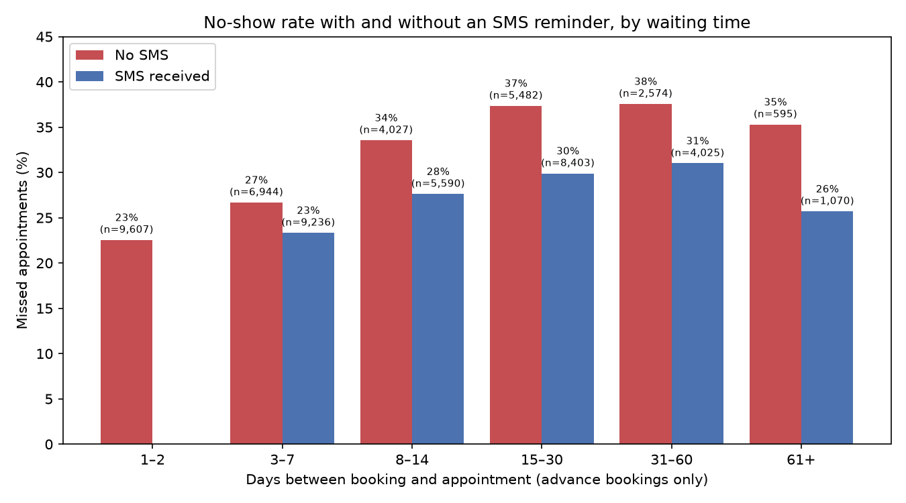
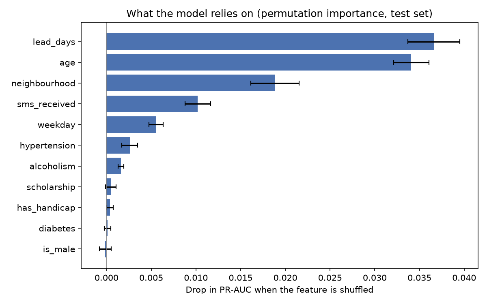

# Predicting Hospital Appointment No-Shows

> A leakage-safe machine-learning pipeline that ranks advance bookings by no-show risk, so a clinic can direct scarce personal reminder calls where they matter most.
>
> **Headline:** on 12,460 unseen patients, calling the model's top-ranked ~10% of appointments reaches no-shows **1.48x** as efficiently as random selection (precision 43.2% vs a 29.1% base rate), about **218 more** at-risk patients reached per 1,544 calls.

## Why I built this
I work as a Health Records Officer. Two patterns in this data were familiar from practice: same-day appointments are usually registered when the patient is already at the facility, and several appointments booked at the same moment are usually multiple services (lab, pharmacy, consultation), not clerical duplicates. Both observations shaped key decisions in this project.

## Data
- **Source:** [Medical Appointment No Shows](https://www.kaggle.com/datasets/joniarroba/noshowappointments), Joni Hoppen / Aquarela Analytics, version 5, licence **CC BY-NC-SA 4.0**. 110,527 appointments from public clinics in Vitória, Brazil (appointments dated 29 Apr – 8 Jun 2016).
- The raw file is not included. Download it into `data/`; its SHA-256 fingerprint is in [`DATA_SOURCE.md`](DATA_SOURCE.md) to confirm you have the identical file.
- **Discrepancies with the source description, verified in the data:** the true no-show rate is **20.2%**, not the 30% in the dataset's headline; the data dictionary describes the two date columns the wrong way round; and `No-show = "Yes"` means the patient did **not** attend.

## Approach
1. **Verification:** file fingerprinted with two independent tools; structure, duplicates and date columns checked against the source description.
2. **Cleaning (documented, asserted in code):** 11 rows removed (impossible ages, implausible age 115, appointments dated before booking); lead time computed from **dates only**, since raw subtraction mislabelled 38,563 same-day visits as negative.
3. **Split before exploration:** 80/20 **by patient** (no patient in both sets) to prevent data snooping and leakage.
4. **Exploration** on the training set only (see Findings).
5. **Scope:** model trained and evaluated on **advance bookings only** (lead time ≥ 1 day). Same-day patients are typically already present, so the clinic cannot act on them.
6. **Model comparison:** 5-fold cross-validation grouped by patient: no-skill baseline, logistic regression, random forest, gradient boosting.
7. **Staged features:** a core model (information known at booking) vs. a version adding leakage-safe patient history.
8. **Pre-registered tuning:** the decision rule was fixed before seeing results.
9. **Frozen threshold, single test evaluation:** the operating threshold was fixed from training predictions; the test set was used once.
10. **Audits:** fairness, robustness to possible duplicates, and permutation importance.

## Key findings

- **Waiting time is the strongest signal.** Same-day patients miss 5%; advance bookings miss 23% at 1–2 days, rising to about a third beyond two weeks.
- **SMS reminders show Simpson's paradox.** Naively, texted patients miss more (27% vs 17%), because texts were only sent for bookings 3+ days ahead. Within the same waiting band, texted patients miss **4–9 points less**. This is an association, not proof of cause.


- **Age matters independently of waiting time:** teens and young adults miss most (~35%), patients 60+ least (~20%).
- **Welfare recipients miss more** (35% vs 28%). **Hypertension and diabetes only appear protective** because their patients are older; within age bands the effect disappears.
- **Neighbourhood** matters (19%–38%); **weekday** modestly (Monday highest); **sex** not at all.

## Results
| Model (5-fold grouped CV) | ROC-AUC | PR-AUC |
|---|---|---|
| No-skill baseline | 0.500 | 0.284 |
| Logistic regression | 0.592 | 0.354 |
| **Random forest (final)** | **0.611** | **0.378** |
| Gradient boosting | 0.604 | 0.373 |

- **Patient history** (e.g. prior missed appointments) is a real signal (29.0% vs 22.2%) but added no measurable gain: only 23% of rows have any history in a six-week window. The simpler core model was kept.
- **Tuning** gave no gain under the pre-set rule (all settings within 0.369–0.378). Three model types, history features and tuning all converge, so **the available features, not the algorithm, limit performance.**
- **Test set (run once):** ROC-AUC **0.605**, PR-AUC **0.375** (no-skill 0.291), close to the cross-validation estimates, so there's no sign of overfitting or leakage.



## How a clinic could use it
The model's value depends on how many patients are contacted:

| Contact top | Precision | Lift vs random |
|---|---|---|
| 10% | 44.5% | 1.57x |
| 20% | 40.6% | 1.43x |
| 70–80% | 31–32% | 1.09–1.13x |

At 70–80% coverage (typical for automated SMS), the model is barely better than random. So the recommended use is **two-tier**:
1. **Automated SMS to all reachable patients**, with no model needed.
2. **A personal call to the riskiest ~10%**, in addition to calls already made on clinical grounds. On unseen patients this reached 667 would-be no-shows per 1,544 calls, versus about 449 by random selection.

## Fairness audit
- **Sex:** no meaningful disparity.
- **Welfare recipients** miss 1.2x as often but are **flagged 2.4x** as often, with equal precision. For supportive calls their no-shows are reached twice as often; **for overbooking, their attenders would be wrongly burdened 2.5x as often** (false positive rate 19.4% vs 7.6%).
- **Age is strongly amplified:** patients 45–59 and 60+ miss 26% and 21% of appointments, yet only 1.0% and 0.2% are flagged. Top-10% selection fills almost entirely with younger patients.
- **Welfare status has near-zero model importance yet drives large flag differences**, most likely through neighbourhood and age acting as proxies. Removing the column would not remove the disparity.

**Recommendations:** use the model **only for supportive actions, never for overbooking**; keep clinical-ground calls, which likely reach the older patients the model rarely flags; allocating calls within age groups is a possible extension, to be designed and tested on training data.

## Robustness
2,607 same-second multi-bookings were kept (they could not be proven duplicates; 29 groups have mixed outcomes). Re-running with one row per booking group changed every result by ≤ 0.002.

## Limitations
- Modest predictive power (ROC-AUC ≈ 0.6) among advance bookings.
- One Brazilian city, six weeks of data from 2016; may not generalise to other settings.
- Scores are rankings, not calibrated probabilities.
- Associations (e.g. SMS) are not causal effects.
- Only 39 Saturday appointments; no data on appointment type or specialty.

## How to run
```bash
git clone https://github.com/Blessing-data/hospital-no-show-prediction.git
cd hospital-no-show-prediction
conda create -n noshow -c conda-forge --override-channels python=3.12 pandas=3.0.6 numpy=2.5.3 scikit-learn=1.9.1 matplotlib=3.11.2 seaborn=0.13.2 jupyterlab=4.6.4 ipykernel
conda activate noshow
mkdir data
# download KaggleV2-May-2016.csv into data/ (see DATA_SOURCE.md), then:
jupyter lab
```
Open `01_no_show_analysis.ipynb` and choose **Kernel → Restart Kernel and Run All Cells**. Assertions throughout verify that every result reproduces.

## Repository
| File | Contents |
|---|---|
| `01_no_show_analysis.ipynb` | Full analysis with decisions documented in place |
| `DATA_SOURCE.md` | Provenance, fingerprints, verified discrepancies, environment |
| `requirements.txt` | Exact package versions |
| `images/` | Charts used in this README |

## About
Health Records Officer moving into health data science and AI.
Dataset © Joni Hoppen / Aquarela Analytics, used under CC BY-NC-SA 4.0.